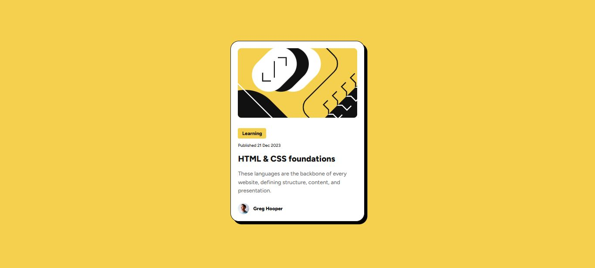

# Frontend Mentor - Blog preview card solution

This is a solution to the [Blog preview card challenge on Frontend Mentor](https://www.frontendmentor.io/challenges/blog-preview-card-ckPaj01IcS). Frontend Mentor challenges help you improve your coding skills by building realistic projects.

## Table of contents

- [Overview](#overview)
  - [The challenge](#the-challenge)
  - [Screenshot](#screenshot)
  - [Links](#links)
- [My process](#my-process)
  - [Built with](#built-with)
  - [What I learned](#what-i-learned)
  - [Continued development](#continued-development)
  - [AI Collaboration](#ai-collaboration)
- [Author](#author)
- [Acknowledgments](#acknowledgments)

## Overview

### The challenge

The challenge was to build a blog preview card that includes hover and focus states for all interactive elements, making it accessible and user-friendly.

### Screenshot



### Links

- Solution URL: [Add solution URL here](https://your-solution-url.com)
- Live Site URL: [Add live site URL here](https://your-live-site-url.com)

## My process

### Built with

- Semantic HTML5 markup
- CSS custom properties
- Flexbox
- CSS Grid
- Mobile-first workflow
- Local font integration using @font-face
- Mobile-first workflow

#### Key Features

- Responsive card layout centered on the page
- Custom font loaded locally (Figtree)
- Clean spacing and typography matching the design
- Hover effect on the blog title for interactivity
- Structured and reusable CSS classes

### What I learned

This project helped me strengthen my understanding of layout structuring and styling consistency. I practiced:

Using @font-face to load local fonts instead of relying on external CDNs
Structuring components using reusable class names
Applying Flexbox for alignment and layout
Implementing hover effects to improve user interaction

Example:

```css
.info-title:hover {
  color: hsl(47, 88%, 63%);
  cursor: pointer;
}
```

### Continued development

Going forward, I would like to improve on:

- Accessibility (better alt text and keyboard navigation)
- Responsive typography using clamp()
- Building reusable components for larger projects
- Improving semantic structure for better SEO and readability

### AI Collaboration

I used AI tools to:

- Refine and structure my README documentation
- Improve wording and clarity
- Review my project for best practices

AI helped speed up documentation and polishing, while I focused on implementing the design and functionality myself.

## Author

- Frontend Mentor - [@jessecharles123](https://www.frontendmentor.io/profile/jessecharles123)
- GitHub - [jessecharles123](https://github.com/jessecharles123)

**Note: Delete this note and add/remove/edit lines above based on what links you'd like to share.**

## Acknowledgments

Thanks to Frontend Mentor for providing this challenge and helping developers improve their skills through practical projects.
